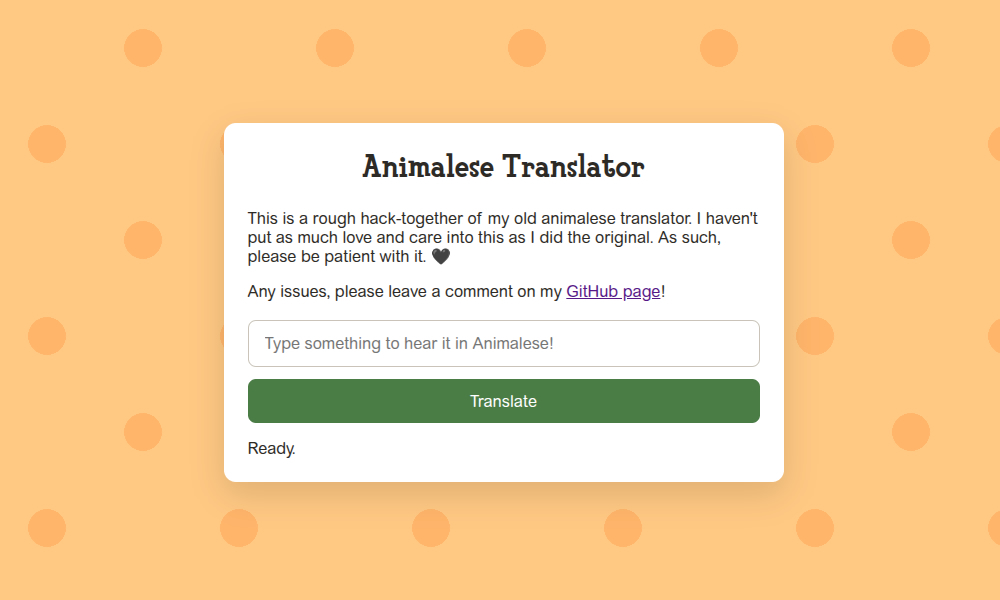

# Read Me

## What is this?

This is a simple program to allow someone to enter text into a web page and then immediately hear back that text as if spoken by a character from the popular video game Animal Crossing.

## Set up and use

You should not have to do any advanced set up. Simply open the `index.html` file in a web browser of choice, enter your text, and then you should hear that text played back to you. It will also generate an "output.wav" file if you wish to reuse this anywhere.

## Notes

This software was created by Hen (henryishuman). Feel free to use and modify at your own discretion. Please credit where used. 🖤
